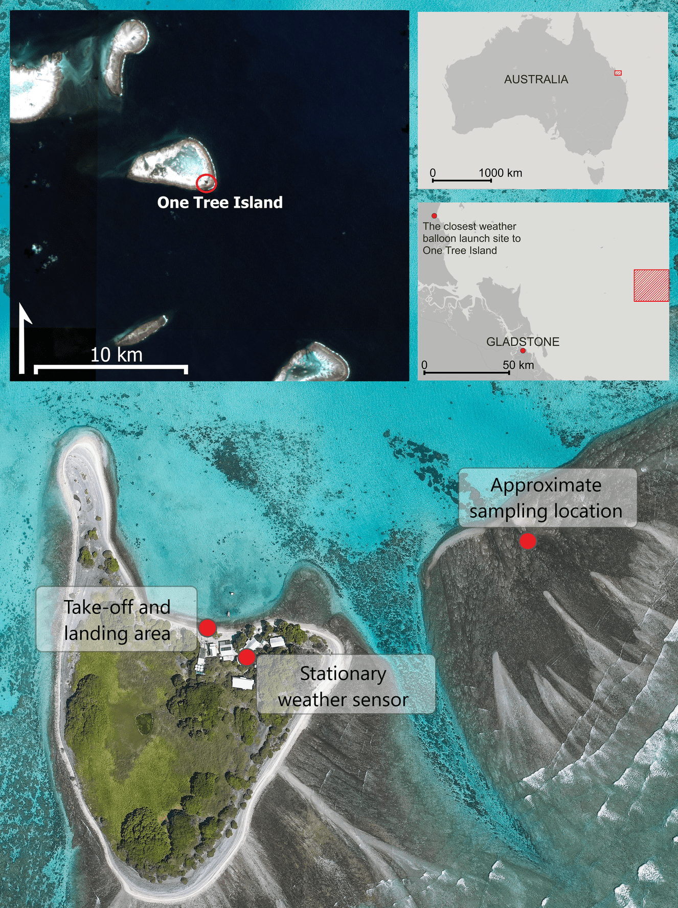

# meteorology-one_tree_island



## Processing atmospheric measurements up to 1500 m above sea level near One Tree Island (Great Barrier Reef) 

This repository contains R scripts to process and merge atmospheric data collected by iMet sensors during DJI M300 drone flights. The merged output is used to analyse wind conditions during aerosol sampling for marine cloud brightening experiments around the Great Barrier Reef and meteorological modeling efforts. 


## Script

`00_functions_clean.R`  
- All relevant functions for the cleaning and merging process

`01_clean_dji_flightlogs.R`  
- Read and clean DJI flight log data as exported by Airdata.com

`02_clean_imet.R`  
- Read, clean, and extract iMet ascent profiles

`03_merge_data.R`  
- Merge manually recorded wind data with iMet data  
- Interpolate wind speed/direction to match resolution of iMet data

## Data  
The repository processes:

- iMet (.csv files), as exported by the sensor.
- Wind profiles for each flight recorded from the flight controller.

Note: Example files are provided in `/data/processed/` to demonstrate the workflow.

## Dependencies  
📦 Required R Packages

```r
install.packages(c(
  "tidyverse",
  "data.table",
  "lubridate",
  "fuzzyjoin",
  "circular",
  "zoo",
  "here"
))
remotes::install_github("bluegreen-labs/cimir")  # for dew point / humidity calculation

```
## Further reading:

https://doi.org/10.3390/drones7120695
https://doi.org/10.1071/ES24008

